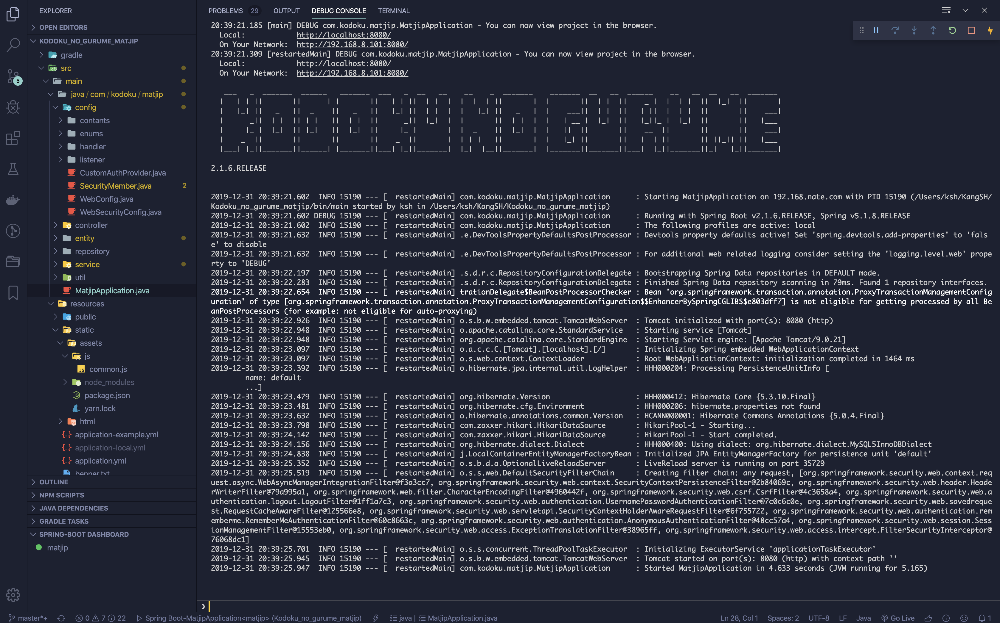

# Personal Project - Restaurants in 'Kodoku no gurume'

## Technology stack to be used (planned) - Latest update 2020-01-12

### Server side

#### Corretto 8 - Production-ready distribution of the OpenJDK 8 created by Amazon

#### Spring Boot 2.2.2.RELEASE

- [Reference Doc.](https://docs.spring.io/spring-boot/docs/2.2.2.RELEASE/reference/html/)
- [API Doc.](https://docs.spring.io/spring-boot/docs/2.2.2.RELEASE/api/)
- Use Spring Boot Starter Dependencies
  - spring-boot-starter-web
  - spring-boot-starter-data-jpa
  - spring-boot-starter-security
  - spring-boot-starter-oauth2-client
  - spring-boot-starter-websocket
  - spring-boot-devtools

#### etc. Dependencies

- [Lombok](https://projectlombok.org/features/all)
- [Querydsl](http://www.querydsl.com/) for JPA

### Databases

- ~~MySQL 5.6.x Latest~~ -> MySQL 5.7.x Latest (2019-12-29)
- Redis

### Client side

- ~~First step using HTML / CSS / jQuery for Web browser.~~
- React SPA for Web browser.
- Next step using React Native or Flutter iOS & Android apps.

#### React.js

- Use Create React App with Typescript

  ```zsh
  npx create-react-app [project name] --typescript
  ```

  - @testing-library/jest-dom
  - @testing-library/react
  - @testing-library/user-event
  - @types/jest
  - @types/node
  - @types/react
  - @types/react-dom
  - react
  - react-dom
  - react-scripts
  - typescript

- etc. Dependencies

  ```zsh
  yarn add styled-components @types/styled-components @material-ui/core
  ```

  - @material-ui/core
  - @types/styled-components
  - styled-components

### Development Environment

- IDE

  - IntelliJ IDEA Ultimate
  - [Visual Studio Code with Java Extensions](#2019-12-31)
  - ~~Eclipse & STS~~ (not recommended for development experience)

- OS

  - Local dev laptop : ~~Windows 10~~ -> macOS Catalina 10.15.x
  - Stage server : Amazon Linux AMI 2018.03.0.20190611 x86_64 HVM gp2

## Daily log of Development

### 2020-02-09

- jenv로 JAVA_HOME이 설정되지 않는 문제 발생
  - 2014년부터 지속된 이슈 - plugin export를 활성화 하는 것으로 문제 해결
    - [jenv plugin 활성화 문제 해결](https://github.com/jenv/jenv/issues/44#issuecomment-561921906)

### 2020-01-16

- homebrew로 설치한 mysql@5.7의 패스워드를 분실했을 경우 대처법
  - 출처: [stack overflow : MacOSX homebrew mysql root password](https://stackoverflow.com/questions/9695362/macosx-homebrew-mysql-root-password)

```shellscript
brew services stop mysql@5.7
pkill mysqld
rm -rf /usr/local/var/mysql/ # NOTE: this will delete your existing database!!!
brew postinstall mysql@5.7
brew services restart mysql@5.7
mysql -u root
```

### 2020-01-11

- Server와 Client 분리 개발 시작
  - Server : Spring Boot GA버전이 업데이트 되어 최신 버전으로 업데이트.
    - 그레이들 버전도 6.x로 업데이트 되어 같이 적용.
      - 다행스럽게도 4.x에서 5.x로 업데이트 될 때에 비해 변경된 부분이 적음.
  - Client : Spring Boot 내부의 Static HTML에서  
    별도의 리액트 클라이언트 어플리케이션 프로젝트로 분리
    - Create React App을 사용하여 개발 시작
    - Typescript 적용
      - Typescript 기본 지원 라이브러리의 경우 index.d.ts라는 파일이 존재하므로  
        따로 typescript 의존성을 설치할 필요는 없으나 지원하지 않을 경우  
        라이브러리명 앞에 '@type/'를 붙여서 추가해야한다.
    - Apply Dependencies
      - @material-ui/core
      - styled-components
        - @types/styled-components

### 2019-12-31

- VSCode Spring Boot 개발환경 구축



- Extensions 설치

  - Java Extension Pack - 기본적인 Java 개발을 도와주는 확장

    - Language Support for Java(TM) by Red Hat
    - Debugger for Java
    - Java Test Runner
    - Maven for java
    - Java Dependency Viewer
    - Visual Studio IntelliCode

  - Spring Boot Extension Pack - Spring 개발을 도와주는 확장

    - Spring Boot Tools
    - Cloudfoundry Manifest YML Support
    - Concourse CI Pipeline Editor
    - Spring Initializr Java Support
    - Spring Boot Dashboard

  - Gradle Extension Pack - Gradle 사용을 도와주는 확장

    - Gradle Language Support
    - Gradle Tasks

  - Lombok Annotations Support for VS Code - Lombok 사용을 위한 확장

- Extensions 설정

  - Settings : Search settings를 활용하여 설정한다.

    - JAVA / Gradle Home 설정

      - .vscode/setting.json

        ```json
          {
            ...,
            "java.home": "/Users/ksh/.jenv/versions/openjdk64-1.8.0.222",
            "java.import.gradle.home": "/usr/local/bin/gradle",
            "java.import.gradle.version": "6.0.1",
          }
        ```

    - Spring Boot Run Active Profiles 설정 : 아직까진 IDEA / STS 4에 비해 부족함.

      - .vscode/launch.json

        ```json
        {
          "configurations": [
              {
                ...,
                        // 읽어들일 yml / properties 파일의 변수를 넣어준다.
                "args":"--spring.profiles.active=local"
              }
            ]
        }
        ```

    - [Java Formatter on Save Settings](https://github.com/redhat-developer/vscode-java/wiki/Formatter-settings) - Goggle Styles

### 2019-12-29

- 개인 프로젝트 다시 시작

  - Front-end React.js를 사용한 SPA로 제작 예정
  - Back-end는 일단 스프링으로 유지.
  - 이시국씨 이슈로 인한 주제 변경 검토 중

- MySQL 5.7.x로 업데이트 : 개발용 랩탑 운영체제 변경에 따른 설치 방법 변경

  - [HomeBrew를 사용하여 설치](https://github.com/helloheesu/SecretlyGreatly/wiki/%EB%A7%A5%EC%97%90%EC%84%9C-mysql-%EC%84%A4%EC%B9%98-%ED%9B%84-%ED%99%98%EA%B2%BD%EC%84%A4%EC%A0%95%ED%95%98%EA%B8%B0)
  - [MySQL 기본 설정은 기존 5.6.x과 같음](#2019-06-23)

- Code Convention 변경
  - Gooogle-java-format / save actions plugin을 활용하여 아름다운 코드 작성
  - code style : indent & tab size = 2, hard wrap cols = 80 설정

### 2019-08-02

- Remember me 기능 추가

  - Spring Security의 자동 로그인 기능 활성화

    - 기본은 UUID로 쿠키의 값이 인코딩되므로 .rememberMe().key() 메서드에 반드시  
      encode key를 할당해야 로직이 정상 작동함
    - 토큰 기반의 Remember me 기능을 위한 TokenBasedRememberMeServices 객체를  
      rememberMeServices()에 Bean 등록하여 넣어준다
      - 항상 기억할 것인지(boolean), 토큰 유효 기한(int sec), 쿠키의 이름등을 지정할 수 있다

  - Security의 세션이 생성/소멸되는 것을 확인하기 위한 리스너 등록.
    - Session의 Create/Destroy 이벤트에 각각 필요한 비즈니스 로직을 [구현](/matjip-server/src/main/java/com/kodoku/matjip/config/listener)하고  
      HttpSessionEventPublisher 클래스를 @Bean으로 등록한다.
  - 자동 로그인 기능 체크를 위한 [login.html](/matjip-server/src/main/resources/static/html/login.html)의 check box 태그 생성

### 2019-07-29

- Lombok을 사용하여 코드 줄이기
- Spring Annotation의 종류 정확히 알고 사용하기
  - [스프링부트 애노테이션 정리](https://jeong-pro.tistory.com/151)
  - [Annotation과 Bean](https://lazymankook.tistory.com/27)

### 2019-07-28

- 로그인 실패 처리 코드 작성
  - [CustomLoginFailureHandler Class 구현](/matjip-server/src/main/java/com/kodoku/matjip/config/handler/CustomLoginFailureHandler.java)
    - response.setStatus()를 사용하여 HTTP 상태 코드를 적용  
      로그인 실패 시 원인을 정확히 전달하도록 작성
    - 기존에 Spring Security에서 제공하는 클래스를 상속하지 않고 interface를 구현하는 방식으로 작성
      - Spring이 기본 제공하는 로그인 관련 handler 클래스들은  
        redirect 또는 forward를 위한 handler이고 interface를 미리 구현해놓은 것으로  
        페이지 이동을 server가 아닌 client에 맡기려는 Rest API 컨셉에 적절하지 않아 직접 구현함
      - response.getWriter()를 사용하여 ajax 요청의 콜백 함수에 response body를 직접 전달
      - 기존에 작성해둔 LoginSuccessHandler도 같은 방식으로 변경
    - 로그인 실패 상세 예외처리
      - 이메일과 비밀번호 중에 틀린 항목을 정확히 전달하도록 변경
      - 회사 코드에 적용할 수 있을 것으로 보임
  - 작동 환경에 따른 채널 보안 로직 적용
    - Environment 객체의 현재 프로파일 정보에 따른 분기처리
      - 현재 stage일 경우 모든 채널("/\*\*")에 대하여 https로 강제 전환되도록 설정
      - 차후 product가 생길 경우 변경 예정
  - JS Library 정리
    - SweetAlert2 Dark theme 사용

### 2019-07-22

- Bootstrap 4.3, SweetAlert2 본격 적용 시작
  - jQuery로 어디까지 만들고 React.js로 변경할 것인지 검토 중

### 2019-07-16

- .gitignore 파일 작동 이상으로 .yml 파일이 remote repo에 push되어
  2번째 git 초기화로 인해 history가 전부 소멸됨
- [.gitignore 파일이 제대로 작동하지 않을 경우에 대한 대책](https://projooni.tistory.com/entry/gitignore-%EC%A0%81%EC%9A%A9-%EC%95%88%EB%90%A0%EB%95%8C)

### 2019-07-11

- Spring Security 설정 및 로그인 로직 작성
  - successHandler에서 ajax response 로그인 처리

### 2019-07-02

- Spring Data Jpa를 통한 1:N 테이블 정의

```java
@OneToMany(cascade = CascadeType.ALL, fetch = FetchType.EAGER)
@JoinColumn(name="user_idx")
private List<Role> roles = new ArrayList<>();
```

- Java 8의 Instant type 필드를 활용한 MySQL timestamp 타입 컬럼 정의

```java
@Column(name = "registration_date", updatable = false, columnDefinition = "TIMESTAMP DEFAULT CURRENT_TIMESTAMP")
private Instant registrationDate;

@Column(name = "update_date", columnDefinition="TIMESTAMP DEFAULT CURRENT_TIMESTAMP ON UPDATE CURRENT_TIMESTAMP")
private Instant updateDate;
```

- EC2 Linux를 통한 ElastiCache 접속하기

  - [클러스터 노드에 연결하는 법](https://docs.aws.amazon.com/ko_kr/AmazonElastiCache/latest/red-ug/GettingStarted.ConnectToCacheNode.html)

- Git
  - 실수로 인한 AWS Credential info file push - .git remove and rebase
  - [좋은 git 커밋 메시지를 작성하기 위한 8가지 약속](https://djkeh.github.io/articles/How-to-write-a-git-commit-message-kor/)

### 2019-06-27

- Spring-data-jpa basic entity config
  - 로그인 로직을 위한 entity 정의, 자동 테이블 생성
    - 테이블의 PK 컬럼에 기본 값을 랜덤 varchar type으로 입력하도록 구성  
      자동 채번 기능인 MySQL의 auto increment를 사용하지 않고  
      hibernate의 기능을 활용하여 varchar Type의 UUID로 발행
    - 차후 다른 DB와 유저/멤버 테이블을 병합할 경우 확장성 용이
    - 시간에 따른 정렬 기준은 등록일 / 변경일을 기준으로 할 것
  - schema 데이터 정렬 방식 utf8-general-ci로 임시 적용  
    MySQL 데이터 정렬 방식을 utf8mb4-unicode-ci로 할 경우  
    Specified key was too long; max key length is 767 bytes 에러 발생  
    해결법을 검색해서 적용했으나 변화 없음
  - User Entity, Role Entity 적용  
    회원가입, 로그인 테스트 필요

### 2019-06-23

- Local laptop installed MySQL 5.6

  - scoop을 사용하여 MySQL 5.6 설치

  ```powershell
    KangSH@KSH-DELL7586 >
    > scoop update
    > scoop status
    > scoop install mysql56 mysql57
    > sudo mysqld --install ## 반드시 관리자 권한으로 실행해야 함
  ```

  - MySQL 5.6 기준 DATABASE, TABLE, USER 설정

  ```mysql
    -- [USER PASSWORD UPDATE]
    GRANT ALL PRIVILEGES ON *.* TO 'root'@'%' IDENTIFIED BY '1111'; -- 모든 권한
    GRANT USAGE ON *.* TO '[ID]'@'[ACCESS HOST]' IDENTIFIED BY '[PASSWORD]'; -- 사용 권한

    -- [CREATE DATABASE]
    CREATE DATABASE [NEW DATABASE NAME]
    DEFAULT CHARACTER SET UTF8
    DEFAULT COLLATE UTF8_GENERAL_CI;

    -- [CREATE USER]
    CREATE USER '[ID]'@'[ACCESS HOST]' IDENTIFIED BY '[PASSWORD]';

    -- [권한 설정]
    GRANT ALL ON [DATABASE NAME].'[TABLE NAME]' TO '[USER NAME]'@'[ACCESS HOST]';  -- 모든 권한
    GRANT SELECT, INSERT, UPDATE, DELETE, CREATE, DROP, INDEX, ALTER
    ON [DATABASE NAME].'[TABLE NAME]'
    TO '[USER NAME]'@'[ACCESS HOST]'; -- 특정 권한
  ```

  - 참조 : [MySQL Windows에 수동 설치하기](http://www.itpaper.co.kr/window%EC%9A%A9-mysql-%EC%88%98%EB%8F%99-%EC%84%A4%EC%B9%98%ED%95%98%EA%B8%B0)

  - 수동 설치 시 [Microsoft Visual C++ 2010 재배포 가능 패키지(x64)](https://www.microsoft.com/ko-kr/download/details.aspx?id=14632)를  
    반드시 설치해야 mysqld를 실행 할 수 있다

### 2019-06-22

- Amazon Linux AMI 인스턴스 생성
- Windows 10 Power Shell SSH 접속
  - [Windows 10 에서 pem 파일을 사용하기](https://swiftcoding.org/lightsail-from-window10)
  - [사용 권한 변경 중에 부모 권한 상속 에러 발생 해결](https://m.blog.naver.com/PostView.nhn?blogId=crehacktive3&logNo=220991428540&proxyReferer=https%3A%2F%2Fwww.google.com%2F)
- [Amazon Linux AMI를 사용하여 LAMP 웹 서버 설치](https://docs.aws.amazon.com/ko_kr/AWSEC2/latest/UserGuide/install-LAMP.html)
